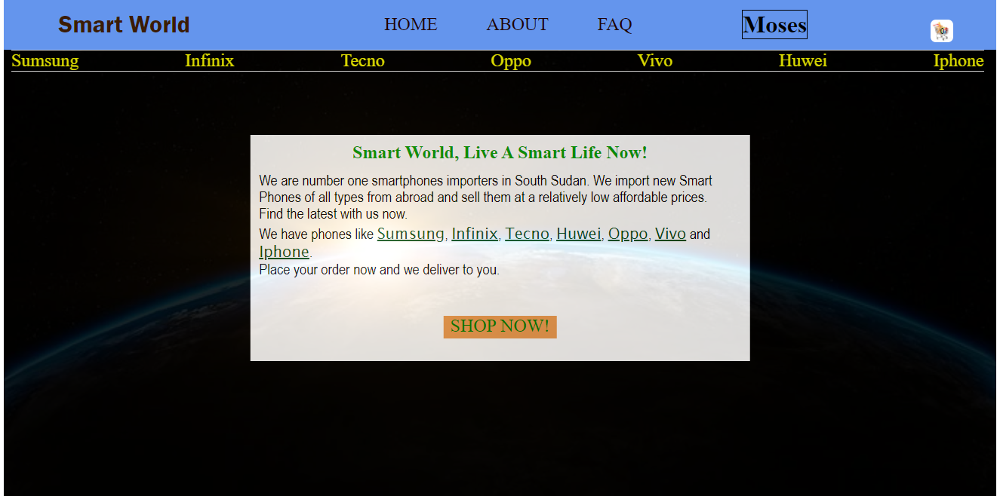

# AN E-COMMERCE WEBSITE FOR COLLEGE PORTFOLIO PROJECT: (LAST TREMESTER)

<a href="https://portfolio-de-moses.netlify.app">Check my Portfolio</a>

***NOTE*** This app is not yet deployed!

## INTRODUCTION

This website is a project for my college portfolio project and it meets demand of a fully functional \
e-commerce website.

As an e-commerce website, it'll have a functional shopping cart and user authentication system for those\
who want to place their orders.

## WHAT INSPIRED ME TO WORK ON THIS PROJECT.

I love business logic and beleived that through tech, business problems can easily be solved. 

While studying JavaScript at simplilearn, one of the projects at the end of course was building a fully functiooning e-commerce website using HTML, CSS and JavaScript.

I did enjoy every bit of the project and surely planned to work on my own project. I then chose python and framework Flask to make my website unique from that of Simplilearn.
I love writing the backend site of my app most, and to be honest I love database management which was not covered at simplilearn.

Though this project didn't completely come as I espected, it's even way better to me because never once at Simplilearn had I successfully finished complete app production.

## NEXT / FUTURE PROJECT:

For any similar project that I might work on in the future, i planned to use ***Odoo*** ( A management software with a range of business application)

## PROJECT TARGET:

This project targets business owners and their customers since it's more of online sale.

## PROJECT REQUIREMENTS:

<ul>
<li>Done on ubuntu 20.04</li>
<li>A README.md file</li>
<li>HTML,CSS and JavaScript</li>
<li>Flask (Python micro framework for web development)</li>
<li>An horuku account for deployment</li>
</ul>

## PROJECT FOLDERS & FILES:

### main.py:
This is the main app file. It's use for connecting the flask application.

### templates:

This folder contains the html code for the project with files i.e;

<a href="templates/index.html">HOME PAGE</a>

And other files.

### static:
The static folder contains css, scripts and images.

## DATABASE USED

### SQLITE & SQLALCHEMY

# USAGE:

### Pre-requist

<ul>
<li>Python3</li>
<li>pip3 if not installed</li>
<li>flask</li>
</ul>

Create a folder e-commerce.

create python virtual environment

$cd e-commerce
$python3 -m venv name

Activate the environment

$source name/bin/activate

Install flask, flask_login and flask_sqlalchemy

$pip3 install flask, flask_sqlalchemy, flask_login

clone this repo.

$export FLASK_APP=app

$flask run

By the end of this project, users should have an interractive server side pages and a well designed client side.

